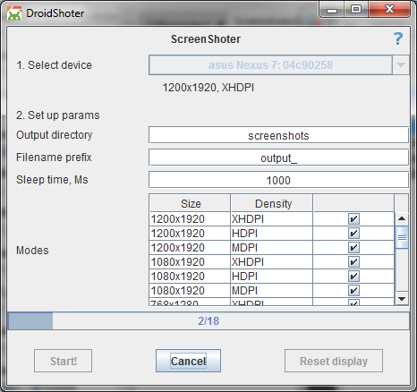
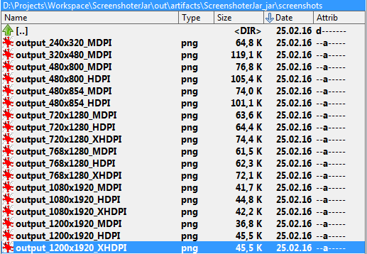
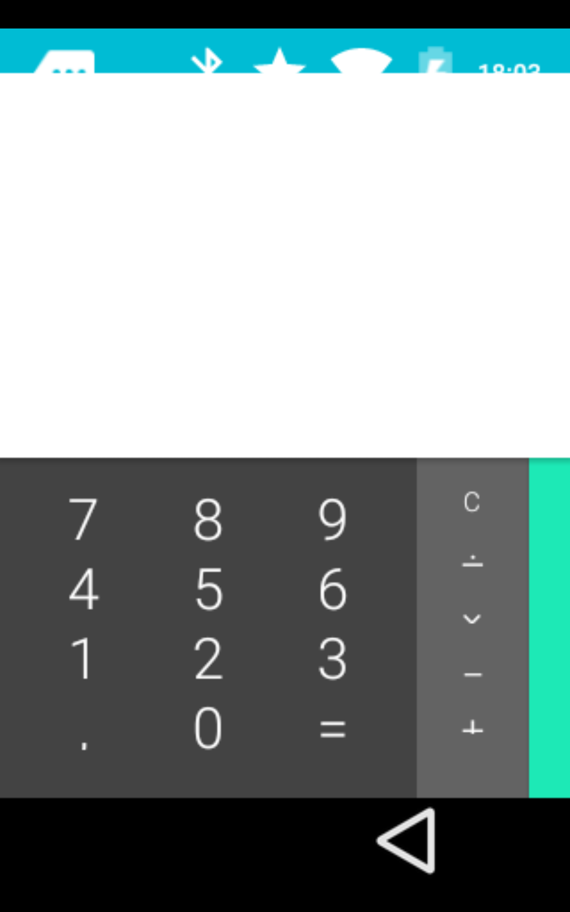
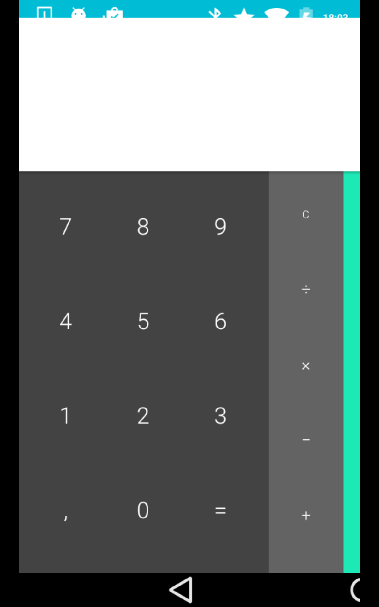
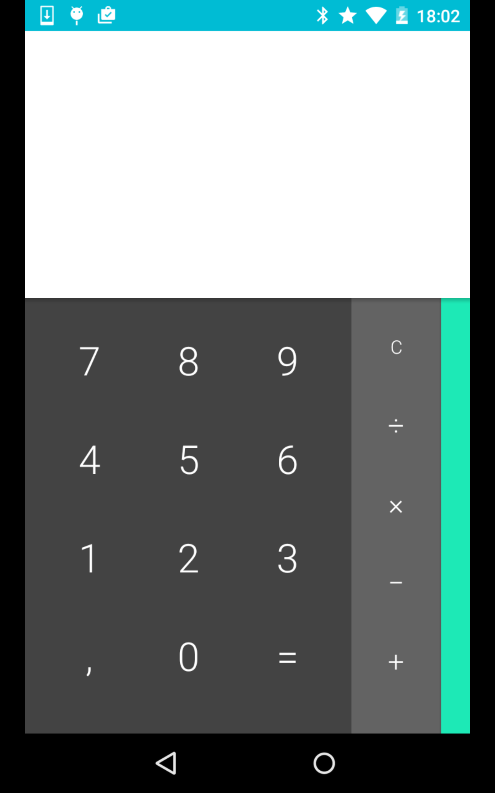
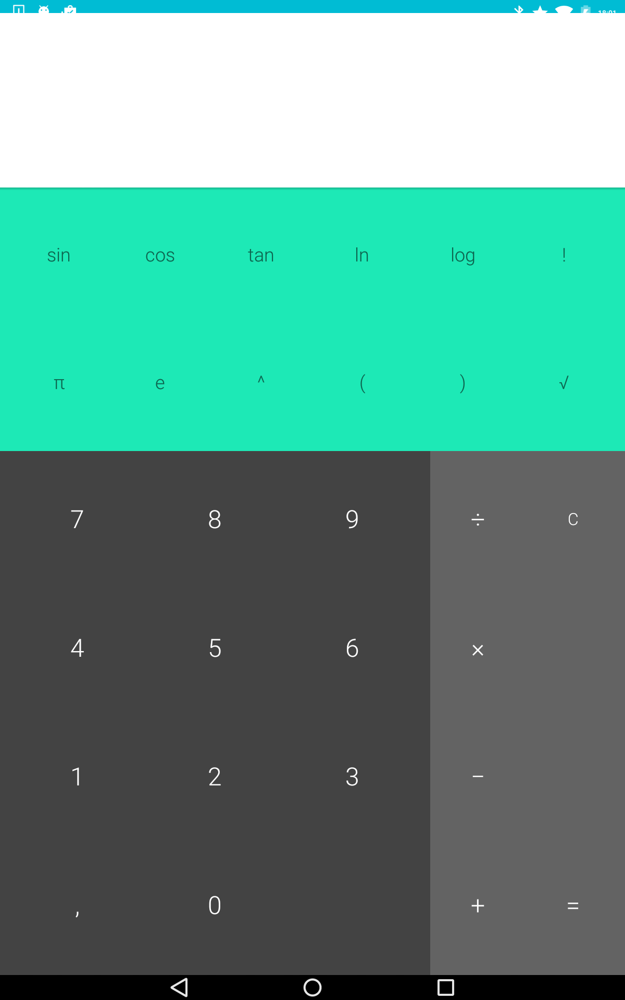

DroidShoter
=================

DroidShoter is a tool for Android apps development / testing which makes screenshots for different screen sizes and resolutions using just one connected device or emulator.

### How it works

DroidShoter picks up display parameters (resolution and density) from any connected device and uses them to create screen parameters queue for further job. After "Start" button is clicked DroidShoter will start changing display parameters and making screenshots.

### Installation

1.  Install [*Java (JRE)*](http://www.oracle.com/technetwork/java/javase/downloads/index.html) or [*Java (JDK)*](http://www.oracle.com/technetwork/java/javase/downloads/jdk8-downloads-2133151.html)

2.  Enable [*"USB debugging"*](http://developer.android.com/tools/device.html#device-developer-options) on your device.

3.  Install adb tool. [*OS X and Linux*](http://forum.xda-developers.com/android/general/adb-fastboot-binaries-os-x-inclusive-t2941205) or [*Windows*](http://forum.xda-developers.com/showthread.php?p=48915118#post48915118). If you are using Windows be sure to install drivers too (part of the installer from link). No need to install fastboot. You can check adb installation using "adb version" terminal command

4.  Launch DroidShoter.jar either by double-clicking or by executing "java -jar DroidShoter.jar" from the terminal

### Download

Download the latest version from the [releases](https://github.com/vfarafonov/DroidShoter/releases/latest) section.

### Job parameters

**Output directory** - directory used to store screenshots (relative or absolute path)

**Filename prefix** - screenshot filename prefix. Filename pattern: \[prefix\]\[width\]x\[height\]\_\[density\]

**Sleep time, Ms** - Sleep time before making a screenshot after display parameters were changed. Use it to give some time for activity to be prepared (draw layouts, request data fom backend).

**Modes** - list of display modes. Calculated based on device's display parameters. Uncheck some modes if you want to skip them. DroidShoter saves last modes parameters for each device. Useful when you need to skip any mode when app cannot be displayed with it (you will see with some blank screenshots or some other troubles)

### Features

-   Automatically detects devices plugging in. No need to restart

-   Saves unchecked modes for every device

-   Support real devices and emulators

-   Reset button can be used if something went wrong and your device did not come back to the origin display params. I did not face this during normal operation but you can get into this by unplugging the device in the middle of the job

-   Tries to find Adb location with ANDROID\_HOME environment variable or shows a file picker if the adb was not found. Path to the adb is saved so you do not need to find it every launch

-   Cancel button can be used to stop the job. Automatically resets device display parameters

### Known issues

-   May have some troubles with picking up default display parameters for some devices with Android older than 4.3. In this case you will not be able to start the job unfortunately.

-   System UI (status bar and bottom buttons layout) may have a wrong size after changing the display parameters. Can't do anything here.

### Issues tracker

Feel free to create [issues on Github](https://github.com/vfarafonov/DroidShoter/issues)

### Future improvements

-   Localisation change support

-   Orientation change support

-   Automatically launch different screens

-   CI systems support

### Output samples

